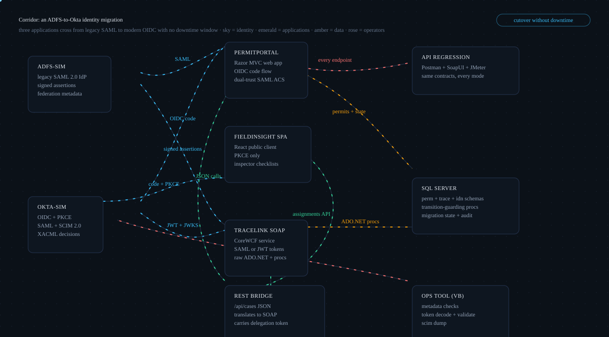
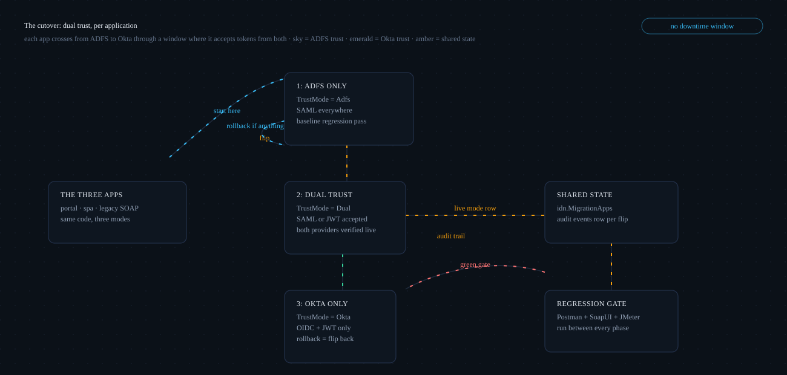
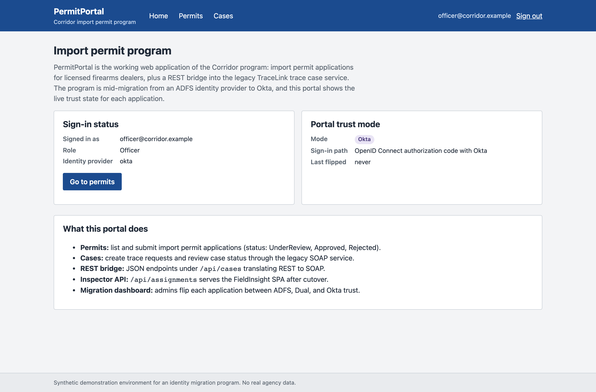
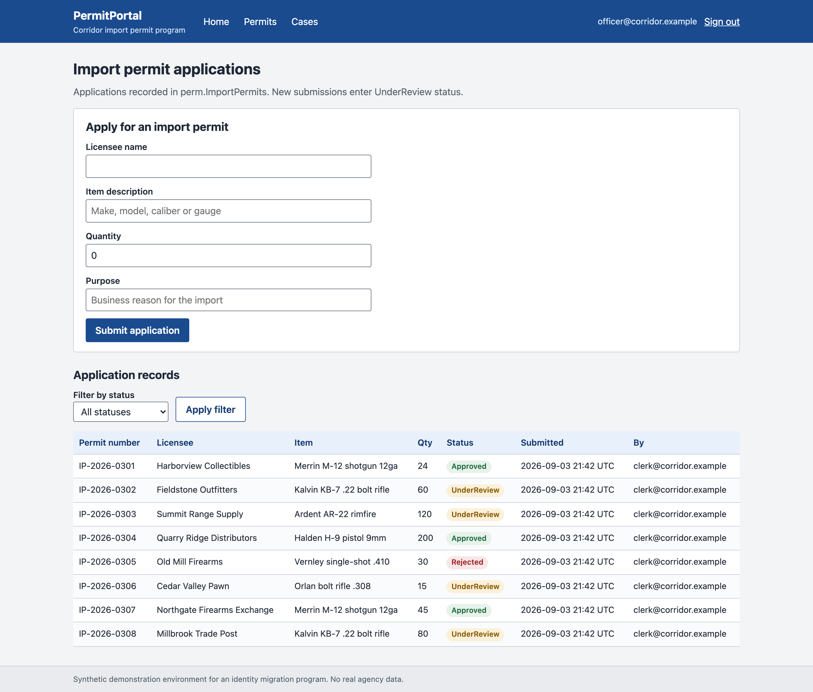
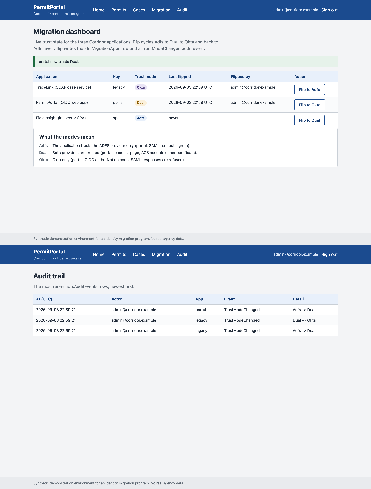
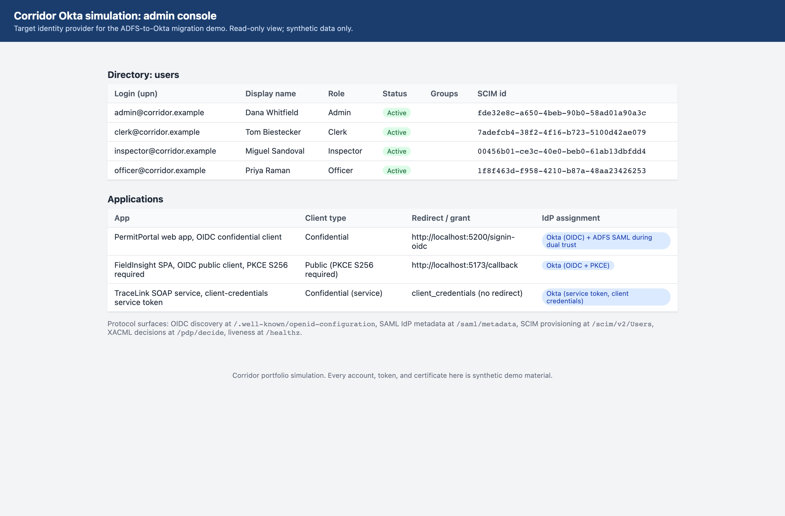
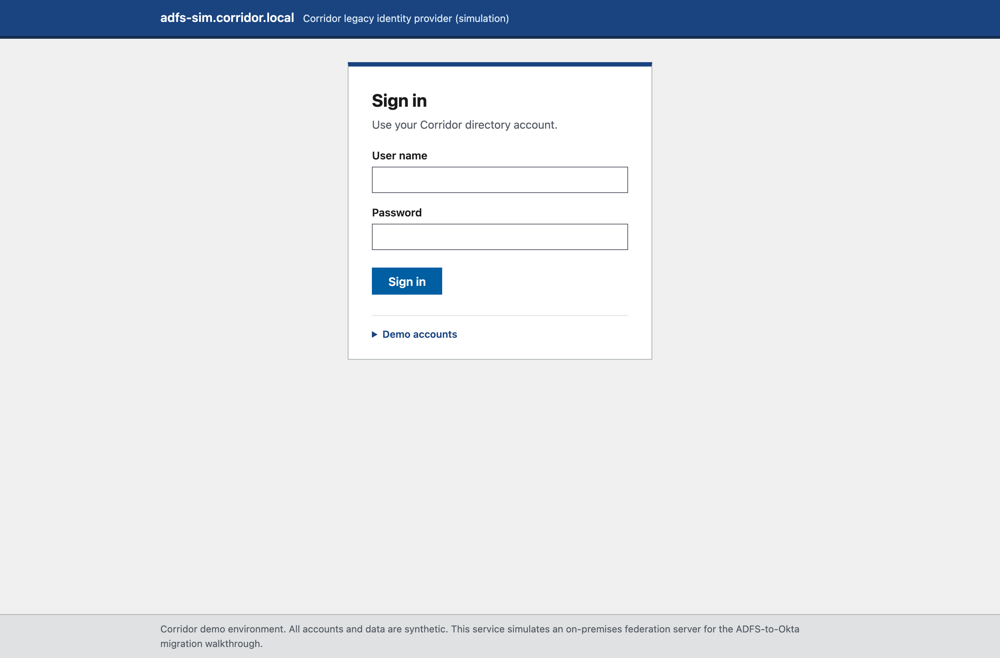
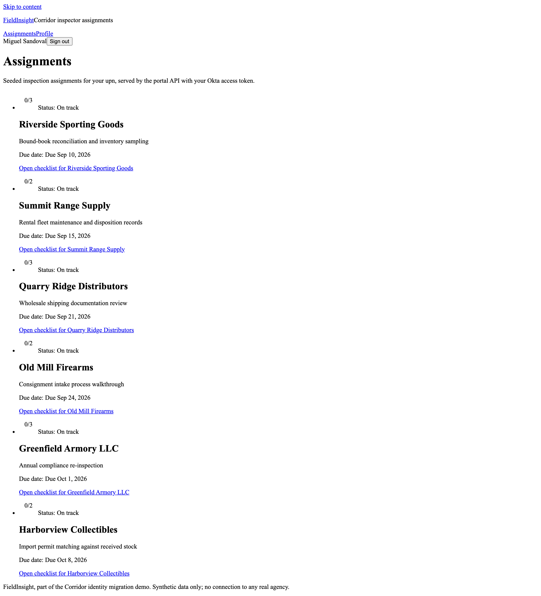

# Corridor

**A synthetic-data demonstration that moves three federal-style applications from a legacy
ADFS SAML login to modern Okta-style authentication with no downtime window.**

[](https://github.com/Alex5350/corridor/actions/workflows/ci.yml)

> **Synthetic data and no affiliation.** This is an independent example inspired by federal
> identity modernization programs. It is not affiliated with, endorsed by, or connected to
> the Department of Justice, the Bureau of Alcohol, Tobacco, Firearms and Explosives, Okta,
> or Microsoft. Every agency, user, licensee, permit, case, and assignment in this repo is
> synthetic. "Okta" and "ADFS" are local simulations that implement the real protocols;
> nothing here talks to any real identity service or government system.

> **Two ways to read this page.** Not an engineer? Everything below the pictures stays in
> plain language, and jargon links to the [glossary](docs/GLOSSARY.md). Engineer? The deep
> dive lives in [TECHNICAL.md](TECHNICAL.md): architecture, request flows, and every major
> decision mapped back to the business problem it solves.

## The problem

Agencies sit on applications bound to aging on-prem identity. Users feel it as separate
logins and slow change: one password per system, a new hurdle for every app. Operators feel
it as every application carrying its own trust plumbing: certificates, claim mappings, and
firewall exceptions that each drift their own way. Leadership feels it as risk: the
identity layer nobody can retire, audited by rules nobody can find in one place.

The instinctive fix, "migrate everything this weekend", fails on contact with reality:
three applications, one of them a SOAP service nobody wants to redeploy, and no agency
that can promise its users a login outage. Corridor demonstrates the other path: each
application crosses from the old provider to the new one through a
[dual trust](docs/GLOSSARY.md) window where both work, flipped per application, with
rollback one click away and an audit row for every change.

## The product in pictures

The shape of the program, then the screens. First, the two committed diagrams: the
estate and the cutover.

<p align="center"></p>

<p align="center"></p>

The interface and the consoles, captured from the running stack:

| Sign in to the portal the new way, and land on a plain, familiar home page | The permit workload, exactly as it was before the migration |
|:---:|:---:|
|  |  |

| The migration dashboard mid-flip: who trusts whom, one button per app | The new provider's admin console: users, apps, assignments |
|:---:|:---:|
|  |  |

| The old login page users leave behind | Inspectors in the field, signed in with the modern browser flow |
|:---:|:---:|
|  |  |

## What it delivers

- **A cutover with no downtime window.** Each application moves from ADFS to
  Okta-style login through a [dual trust](docs/GLOSSARY.md) window where both providers
  work; users never see an outage page, and the flip is a live state change, not a
  deploy.
- **Rollback that costs one click.** Because trust mode lives in the database with an
  audit row per change, reversing a bad flip is another flip, not an emergency release.
- **The SOAP service stays a SOAP service.** The riskiest legacy asset crosses to modern
  identity with its WSDL contract untouched; its callers change nothing.
- **Accounts that move with the migration.** [Provisioning](docs/GLOSSARY.md) via a
  standard API means users exist in the new provider, with the right roles, before their
  first modern login.
- **Authorization rules in one reviewable place.** Who may read trace cases or write
  inspection assignments is decided by readable policy files with a default-deny
  fallback, not code scattered across three apps.
- **Evidence, not vibes, at every phase.** A committed Postman, SoapUI, and JMeter
  regression suite re-runs against the same contracts between every phase, so each flip
  is guarded by a green run anyone can reproduce.

## How the engineering solves it

Plain-terms bridge; each item links to the full story in [TECHNICAL.md](TECHNICAL.md).

- **"We cannot take an outage" drives everything.** A per-application trust switch kept
  in SQL, moved through an both-providers-work middle state, and audited on every change,
  is what makes the [cutover](docs/GLOSSARY.md) reversible and invisible to users
  ([TECHNICAL.md, the decision table](TECHNICAL.md#how-the-tech-solves-the-business-problem)).
- **The browser app cannot keep a secret, so it proves itself instead.** The inspector
  SPA uses the modern sign-in flow with a one-time browser-side proof
  ([PKCE](docs/GLOSSARY.md)), eliminating the leaked-secret incident class for field
  devices ([TECHNICAL.md, request flow](TECHNICAL.md#request-and-data-flow)).
- **The old login service and the new one speak completely different languages.** Real
  protocol implementations on both sides, with a translation point per application:
  the web app learns the new protocol, the SOAP service accepts either token in its
  security header
  ([TECHNICAL.md, architecture](TECHNICAL.md#architecture)).
- **"Will people still get in at 9am?" is answered before it is asked.** Accounts are
  [provisioned](docs/GLOSSARY.md) through a standard API and verified by an independent
  regression suite between phases, so first-login failures are found in the test run,
  not the help queue
  ([TECHNICAL.md, testing](TECHNICAL.md#testing)).

<details>
<summary><b>For developers: quickstart</b></summary>

Prerequisites: Docker (compose v2), the .NET 10 SDK, and Node 22 for the SPA. On macOS,
note that the AirPlay Receiver squats port 5000; the portal therefore runs on **5200**
(this bites every Mac developer exactly once).

One command brings up SQL Server, applies the schema and seed, builds and starts every
service, and waits for each health endpoint:

```bash
scripts/dev-up.sh          # stop with scripts/dev-down.sh (CORRIDOR_PURGE=1 also drops the db volume)
```

Then open:

| What | Where |
|---|---|
| Portal (PermitPortal) | http://localhost:5200 (Admin > Migration for the dashboard) |
| okta-sim admin console | http://localhost:8080 (read-only persona UI) |
| adfs-sim login page | http://localhost:8090 |
| TraceLink WSDL | http://localhost:8000/TraceLink.svc?wsdl |
| FieldInsight SPA | http://localhost:5173 |

Demo logins (synthetic users, same password everywhere):

| Upn | Role |
|---|---|
| admin@corridor.example | Admin |
| inspector@corridor.example | Inspector |
| officer@corridor.example | Officer |
| clerk@corridor.example | Clerk |

Password for all: `Demo1234!`. All apps start in ADFS trust mode; flip them from the
portal's Admin > Migration page.

The operator console (VB.NET), for the questions a flip window raises:

```bash
dotnet run --project src/Corridor.Ops.Tool -- check-metadata --idp adfs
dotnet run --project src/Corridor.Ops.Tool -- validate-token <jwt> --jwks http://localhost:8080/jwks --iss http://localhost:8080 --aud legacy
dotnet run --project src/Corridor.Ops.Tool -- scim-dump --url http://localhost:8080 --token corridor-scim-token
```

Day-one walkthrough with repo tour and demo script: [docs/onboarding.md](docs/onboarding.md).

</details>

## Documentation

| Document | What it covers | Audience |
|---|---|---|
| [TECHNICAL.md](TECHNICAL.md) | Architecture, request flows, decisions mapped to business problems, stack rationale, testing | Engineers |
| [docs/GLOSSARY.md](docs/GLOSSARY.md) | Identity-migration and engineering terms, plain English first, precisely second | Everyone |
| [docs/migration-plan.md](docs/migration-plan.md) | The migration itself: scope, per-app approach, phases with entry/exit criteria and rollback, risks, sign-off | Program and engineers |
| [docs/implementation-plan.md](docs/implementation-plan.md) | Workstreams, sequencing, per-app task breakdown against the repo layout, definition of done | Engineers |
| [docs/test-plan.md](docs/test-plan.md) | Test tiers and counts, per-phase gates, identity-mode matrix, defect triage, exit criteria | QA and engineers |
| [docs/requirements-and-stakeholders.md](docs/requirements-and-stakeholders.md) | Personas, user stories with acceptance criteria, story-to-implementation traceability | Program and engineers |
| [docs/onboarding.md](docs/onboarding.md) | Day-one guide: prerequisites, startup, repo tour, test tiers, flipping TrustMode, demo script | New developers |
| [docs/runbook.md](docs/runbook.md) | Operations: health checks, TrustMode flip procedure, token troubleshooting, rotation, swap-to-real, backup | Operators |
| [docs/security.md](docs/security.md) | What is deliberately demo-grade versus production-hardened | Everyone |
| [docs/security-findings-log.md](docs/security-findings-log.md) | The findings ledger from static and web scanning, each with its fix | Engineers |
| [docs/process.md](docs/process.md) | The build narrative: the war stories told as debugging stories, and the deliberate choices | Engineers |
| [docs/adr/](docs/adr/) | Nine decision records with context and consequences | Engineers |

## License

MIT. See [LICENSE](LICENSE).
